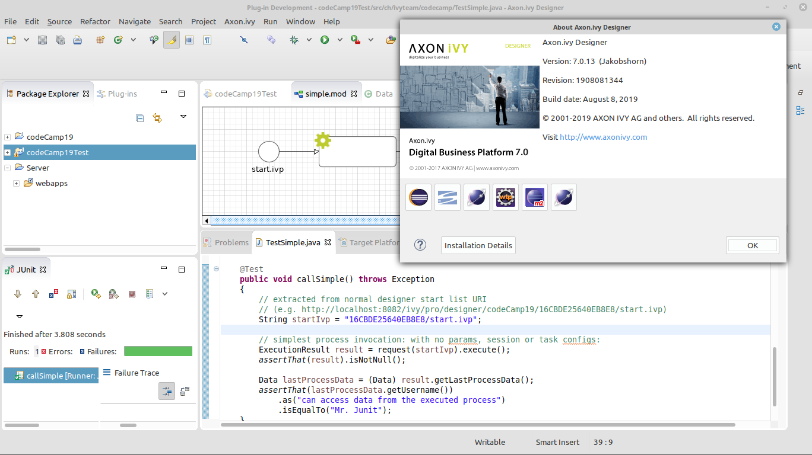
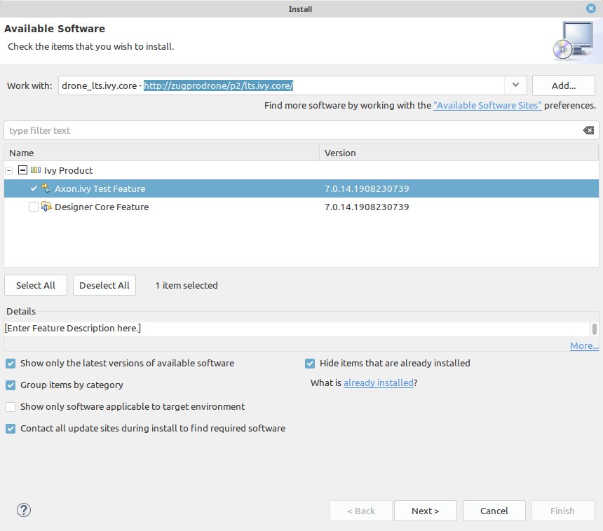

# bpm-exec-tests

> results from a Code Camp 19 journey

Demonstrates how process execution tests can be written using lots of internal ivy-core API. However, this aproach gives a glimpse on already available facilities from the ivy-core, that scream for a public release.

## Install
- Download an official Axon.ivy Designer (tested with 7.0.13)
- Install ivy-core test features using their drone repository (only available within Axon.ivy network)
	- Designer Menu > Help > Install New Software
	- Add Site > http://zugprodrone/p2/lts.ivy.core/
	- Select > IvyProduct > Axon.ivy Test Feature
	- Click through the install process (let designer solve issues, accept all certs & warnings)
	- Reboot Designer
- Import all projects in this repo to your Designer workspace
- Copy your Designer 'webapps' directory into the 'Server' project
- Run 'SimpleTest'

